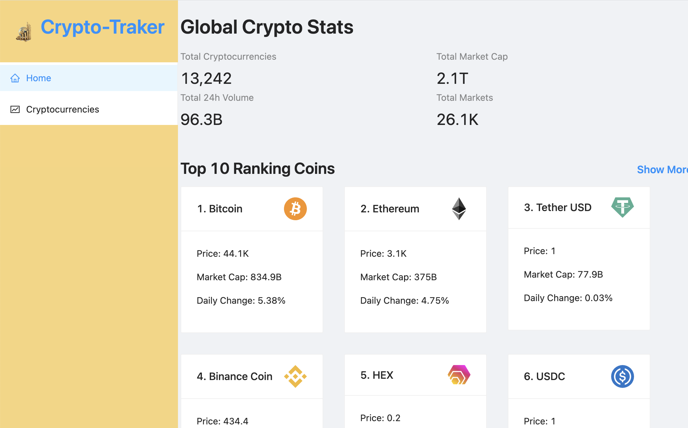
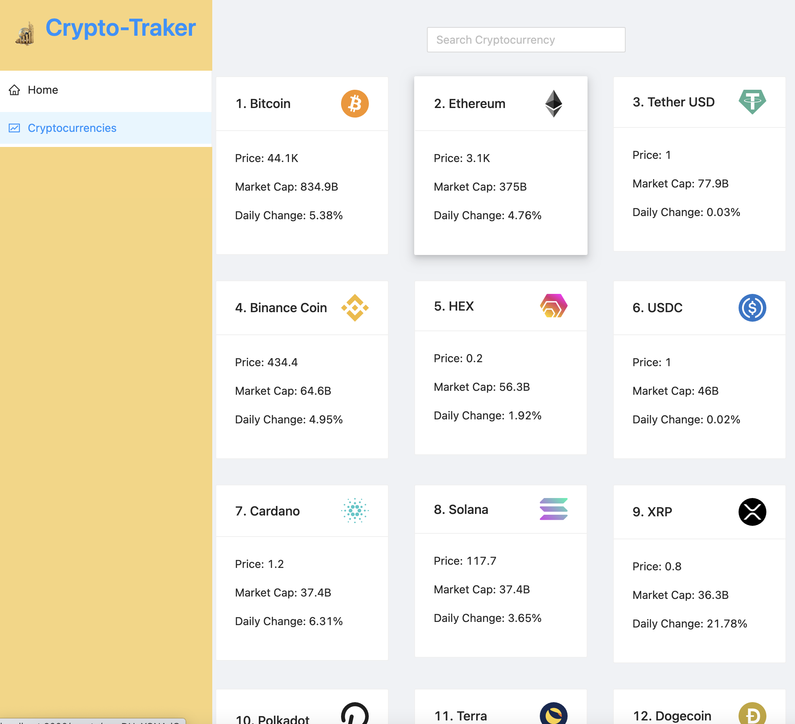

## Cryptocurrency Price Tracker 
 

> Cryptocurrency is a form of payment that can circulate without the need for a  central monetary authority such as a government or bank.
>These days Crypto is getting popular among people so an application to get the  latest price for different cryptocurrencies will be useful.

 

###   Tech stack used for this project:

- ReactJS
- Redux
- RESTful API
- JavaScript
- CSS

 

### Deployed link:

[Cryptocurrency-Tracker](https://cryptocurrency-tracker-price.netlify.app/)

&nbsp;

### Coinranking API:
https://coinranking1.p.rapidapi.com

 

### Home Page:
 

 

### Cryptocurrencies Page and Search:

 

### Cryptocurrency Details:

